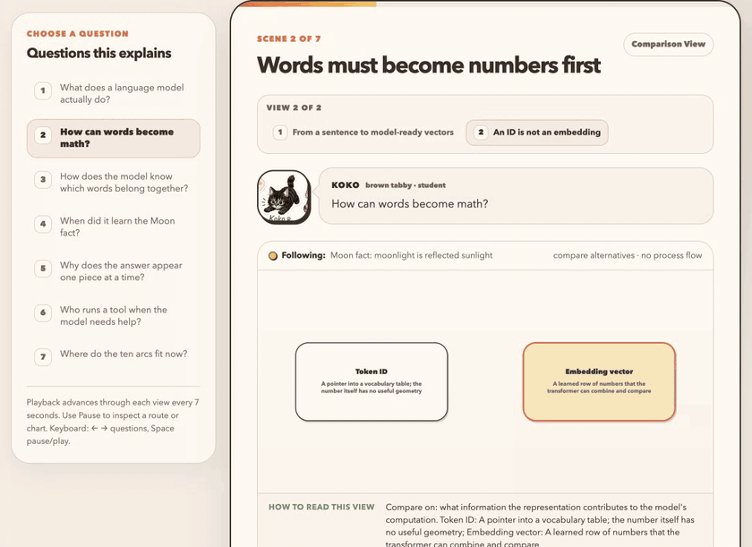
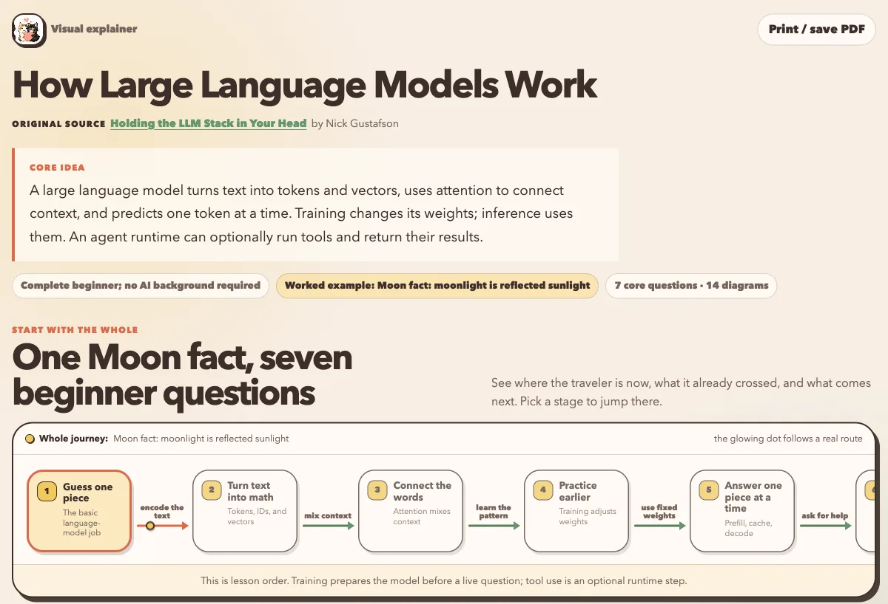
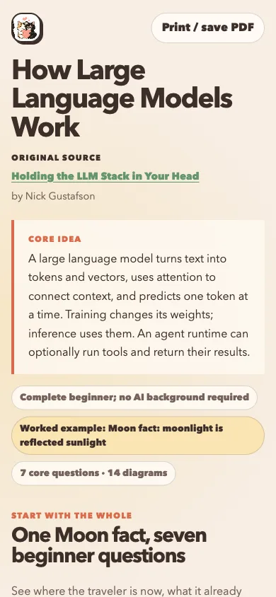

# Miko Fireworks Explainer

An Agent Skill for building grounded, self-contained visual lessons with Michi, a calico cat sensei, and Koko, a curious brown tabby student.

The skill turns a topic into a validated JSON lesson and one offline HTML artifact with a whole-journey map, explicit flows and branches, view-specific reading guidance, evidence states, controls, and teach-back questions. It includes deterministic Node.js tooling and makes no runtime network requests.

Generated lessons open with a compact, plain-language topic title, an original-source link when the request is based on an article or other source, and a summary of the core concept. Character framing begins inside the lesson rather than competing with the subject in the hero.

## See it in action

This example turns Nick Gustafson's [Holding the LLM Stack in Your Head](https://thegustafson.com/series) into a source-led beginner lesson. One concrete Moon fact stays visible while the learner moves from text and vectors to attention, training, generation, and optional tool use.



The controls switch questions, diagram views, and explanation depth while preserving the selected example and its causal route.

<p align="center">
  
  
</p>

The desktop overview leads with the topic, source, and core idea. The same self-contained HTML reflows at 390 pixels without dropping the teaching context.

## Requirements

- Claude Code, Codex, or Cursor with Agent Skills support
- Node.js 18 or newer
- A modern browser for the required visual QA pass

No package installation or API key is required.

## Install once for Codex, Cursor, and Claude Code

Codex and Cursor discover personal skills in `~/.agents/skills`. Claude Code discovers them in `~/.claude/skills`. Clone once and link that same checkout into Claude Code:

```bash
mkdir -p ~/.agents/skills ~/.claude/skills
git clone https://github.com/snowan/miko-fireworks-explainer.git ~/.agents/skills/miko-fireworks-explainer
ln -s ~/.agents/skills/miko-fireworks-explainer ~/.claude/skills/miko-fireworks-explainer
```

If the Claude Code destination already exists, remove or rename that exact stale skill directory before creating the link. Restart the agent if it does not discover the newly installed skill.

For a repository-scoped installation, clone into `.agents/skills/miko-fireworks-explainer`. Claude Code can use a second checkout at `.claude/skills/miko-fireworks-explainer` or a relative link:

```bash
mkdir -p .agents/skills .claude/skills
git clone https://github.com/snowan/miko-fireworks-explainer.git .agents/skills/miko-fireworks-explainer
ln -s ../../.agents/skills/miko-fireworks-explainer .claude/skills/miko-fireworks-explainer
```

These locations follow the [Agent Skills specification](https://agentskills.io/specification), [Claude Code Skills documentation](https://code.claude.com/docs/en/slash-commands), [Codex Skills documentation](https://learn.chatgpt.com/docs/build-skills), and [Cursor Skills documentation](https://prod.cursor.com/docs/skills).

## Use

Ask the agent naturally, or invoke the skill explicitly:

```text
Use miko-fireworks-explainer to teach how OAuth authorization code flow works.
```

- Codex: `$miko-fireworks-explainer`
- Claude Code: `/miko-fireworks-explainer`
- Cursor: `/miko-fireworks-explainer`

The skill writes lesson artifacts outside its installation directory. A typical tool run is:

```bash
node <skill-dir>/scripts/validate.mjs lesson.json
node <skill-dir>/scripts/render.mjs lesson.json lesson.html
node <skill-dir>/scripts/check-html.mjs lesson.html
```

Then inspect every view at desktop and mobile widths. The selected view exposes `window.__mikoDiagramAudit` for node overlap, route crossing, edge-label, traveler, and mobile-topology checks.

## Develop and verify

```bash
npm test
node scripts/validate.mjs assets/examples/agent-memory.json
node scripts/validate.mjs assets/examples/opensandbox.json
```

The OpenSandbox example is a regression fixture for return-path direction, explicit choice branches, comparison dimensions, hub routing, and mobile semantic preservation.

## Repository layout

- `SKILL.md` — portable Agent Skill instructions and metadata
- `scripts/validate.mjs` — lesson semantics and topology validation
- `scripts/render.mjs` — deterministic offline HTML renderer
- `scripts/check-html.mjs` — artifact contract checks
- `scripts/test.mjs` — regression suite
- `references/` — progressively loaded authoring and QA guidance
- `assets/demo/` — README screenshots and interaction walkthrough
- `assets/examples/` — validated lesson fixtures
- `assets/characters/` — bundled dialogue art
- `agents/openai.yaml` — optional Codex UI metadata

## License

Source code and documentation are MIT licensed. Bundled character artwork is excluded from the MIT license; see [ASSET-LICENSE.md](ASSET-LICENSE.md) and [references/asset-provenance.md](references/asset-provenance.md).
